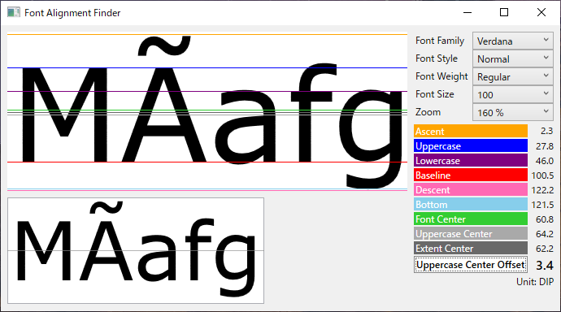
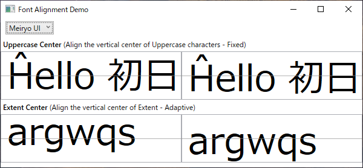

# Font Alignment

Font Alignment is a set of tools for adjusting the vertical center of text taking font metric into account.

- __Font Alignment:__ Core library.

- __Font Alignment Finder:__ A Windows tool to visualize font metric so as to find the vertical center of Uppercase characters or that of Extent as well as its offset from the vertical center of font. That information will be helpful for software developers and designers to adjust the vertical alignment of text.<br /><br />


- __Font Alignment Demo:__ A WPF app to demonstrate attached property included in core library for `TextBlock`, `TextBox` or other `Control`. It will automatically adjust the vertical alignment of text by changing padding.<br /><br />


## Requirements

The core library works on Windows and compatible with:

.NET 5.0|.NET Framework 4.7.2
-|-

The calling app must include app.manifest which declares DPI awareness.

## Background

The basic way to obtain font metric is explained in the following article.

 - [Get font metrics in a WPF program using C#](http://csharphelper.com/blog/2015/05/get-font-metrics-in-a-wpf-program-using-c/)

You can align a text inside the element which hosts the text by setting vertical alignment. It is generally easy but it might not be enough to place the characters of text TRUELY at the vertical center of element because  font glyphs are often more or less aligned to the top or bottom inside font.
 
The degree of offset between the center of font glyphs and the center of font depends on each font and character. This offset is a part of font design but sometimes it could be troublesome. To fine-tune the vertical alignment of text, you need to move up or down the text by arbitrary length but it is not always easy to find the appropriate length.

__Font Alignment Finder__ will greatly help to find the appropriate length for the specified font family, style, weight and size. <ins>To check fonts that have not been installed yet, place them on the desktop so that they will be automatically detected.</ins>

## Usage

The sample usage of attached property is something like as follows.

```xml
<UserControl x:Class="FontAlignmentDemo.Sample"
             xmlns="http://schemas.microsoft.com/winfx/2006/xaml/presentation"
             xmlns:x="http://schemas.microsoft.com/winfx/2006/xaml"
             xmlns:fa="clr-namespace:FontAlignment;assembly=FontAlignment"
             Height="200" Width="200">
    <TextBox Width="200" Height="72"
             VerticalContentAlignment="Center"
             ClipToBounds="True"
             FontFamily="Verdana" FontWeight="SemiBold" FontSize="60"
             fa:FontAlignment.Method="UppercaseCenterShrink"
             fa:FontAlignment.BasePadding="8,0"
             fa:FontAlignment.Text="{Binding RelativeSource={RelativeSource Self}, Path=Text}"/>
</UserControl>
```

This attached property offers 4 methods to make respective vertical center to be shown at the vertical center of element (e.g. `TextBox`).

| Method                | Description                                                              |
|-----------------------|--------------------------------------------------------------------------|
| UppercaseCenterShrink | Aligns the vertical center of Uppercase characters by shrinking padding. |
| UppercaseCenterExpand | Aligns the vertical center of Uppercase characters by expanding padding. |
| ExtentCenterShrink    | Aligns the vertical center of Extent by shrinking padding.               |
| ExtentCenterExpand    | Aligns the vertical center of Extent by expanding padding.               |

Generally, if the height of element is fixed, UppercaseCenterShrink will produce a good result. However, in some fonts, the vertical center of actual font glyphs does not match the the center of Uppercase characters. To use such fonts, specify ExtentCenterShrink instead.

The following properties will work well in combination with this attached property.
 - `VerticalContentAlignment="Center"` is necessary to align text itself.
 - `ClipToBounds="True"` is to prevent text highlight area from sticking out the outline of element when text is highlighted.

## History

v1.0 2021-12-31

 - Initial release

## License

 - MIT License
